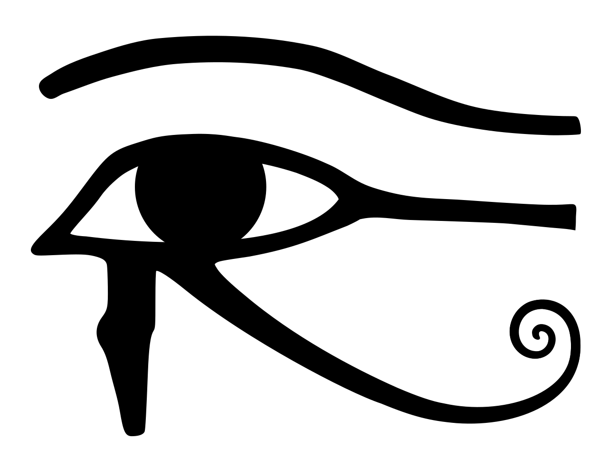

<!-- PROJECT INFO -->
 

  
  
  
  <h3 align="center">HORUS- Dashboard</h3>

  

  
    Dashboard for SAP servers using ansible, pyrfc, influxdb and grafana. focused in:
    
    MONITORING:
    - Dashboard overview of systems. fast, easy and productive.
    
    SECURITY:
    - Hardening focused with SAP best practices

    This project will be update in my free time, if someone want to help, write me some email or push some commit.
  

<!-- ABOUT THE PROJECT -->
## About The Project

Here's why:

"The Eye of Horus is an ancient Egyptian symbol of protection"

* Your time should be focused on creating something amazing and not losing time with repetitive tasks, for that I want to save time specially SAP Consultants and Security teams
* SAP is not easy to understand and exist a big gap between SAP and Security. This project will help to have some clearly simple task done in the fast and correct way.
* You should implement DRY principles to the rest of your life :smile:

<!-- ABOUT THE PROJECT -->
## Pending

* I'm starting right now, let me some time...
