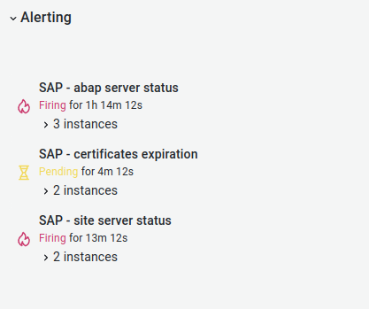
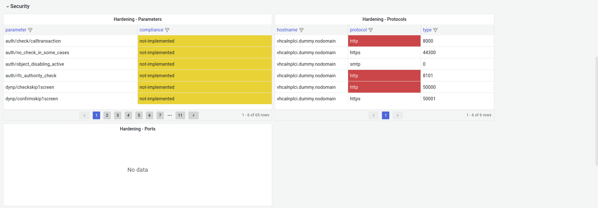

<!-- PROJECT INFO -->

  
  
  
  <h1 align="center">HORUS</h1>

  

    Dashboard for SAP servers using ansible, pyrfc, influxdb and grafana. focused in:
    
    MONITORING:
    - Dashboard overview of systems. fast, easy and productive.
    
    SECURITY:
    - Hardening focused with SAP best practices.
    
    AUTOMATION:
    - Some repetitive tasks.

    This project will be updated in my free time, if someone want to help me, write me some email or push some commit.
  

<!-- ABOUT THE PROJECT -->
## About The Project:
> Here's why:
> 
> * "The Eye of Horus is an ancient Egyptian symbol of protection"
> 
> * Your time should be focused on creating something amazing and not losing time with repetitive tasks, That's why I want to help save time specially SAP Consultants and Security teams.
> * SAP is not easy to understand and exist a big gap between SAP and Security. This project will help to have some clearly simple task done in the fast and correct way.
> * You should implement DRY principles to the rest of your life :smile:

<!-- ABOUT THE PROJECT -->
## Pending:
> - [ ] Dashboard   (50%).
> - [ ] Cleanup scripts for upload.
> - [ ] Alerts.
> - [ ] Hardening.
> - [ ] I'm starting right now, let me some time...

<!-- Some ideas to be included -->
## Ideas:
> 
> 
> 

<!-- Contact me -->
## Get in touch:

* Website: https://limbail.com
* Email: limbail@protonmail.com

<!-- Some screenshots -->
## Some screenshots of actual status:
* Dashboard:

* Alerts:

* Security:

